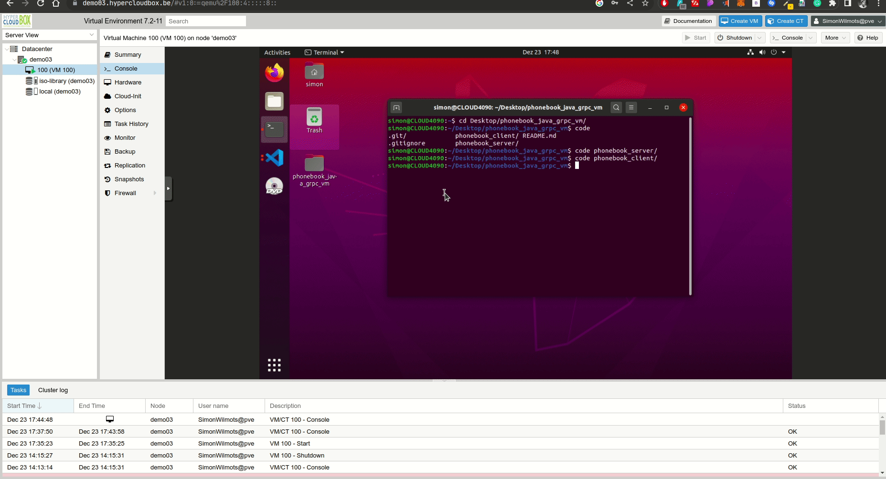

# phonebook_java_grpc_vm

## Run Phonebook with Java & GRPC
*Deze applicatie is iets ingewikkelder om op te zetten*  

* Open beide folder (server & client) in een apparte instantie van Visual Studio Code (of eender welke IDE dat Java runnen ondersteund)  
* Open voor beide Java projecten (in de apparte instanties van vscode) de `App.java`-file. Deze bevinden zich op `src/main/java/be/cloud` van de respectievelijke projecten.  
* Gebruik de 'Run and Debug' feature in vscode in beide App.java files. Eerst de server, daarna de client.

## VM implementatie (HyperCloudBox)
Ik heb gebruik gemaakt van het platform [HyperCloudBox](https://www.systray.be/hypercloudbox) van het bedrijf Systray Solutions. Dit is het bedrijf van de gastspreker Dhr. Filip De Sutter. Ik heb namelijk een studentenlicentie aangevraagd en hierop mijn Java applicatie geimplementeerd.  
  
*Runnen van Java App (server + consumatie) op Linux VM van HyperCloudBox*
